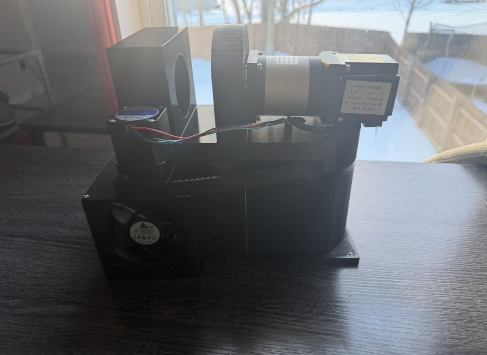

# Robot Arm (ESP32) — 6-Axis Desktop Arm (In Progress)

  
    
  
   
  <em>J1/J2 assembly and PCB test result</em>

A table-mountable 6-axis desktop robot arm project focused on being **publishable, reproducible, and upgradeable**.  
Target is a **real 2.0 kg payload** using **COTS metal planetary gearboxes** on the high-torque joints, with careful bearing design so gearboxes are not used as structural supports.

---

## Status
- Parts: most items arrived; **waiting on gearboxes + NEMA23-related hardware**
- Current work: stepper driver bring-up, bench testing, and PCB validation
- Controller: single-axis tests done earlier; multi-axis control target is **ESP32**

See: `LOGS/robot_arm_engineering_log.txt`

---

## Goals (v0.2)
- **Axes:** 6 (J1–J6)
- **Payload:** 2.0 kg at tool flange (static target, arm extended)
- **Reach:** TBD (goal ~330 mm; acceptable 300–350 mm)
- **Motor rail:** 24V recommended
- **Repeatability:** 0.5–1.0 mm (realistic for stepper + gearbox)
- **Joint speed:** ~30–60°/s on large joints

---

## Architecture Overview

### Drivetrain plan
- J2 (shoulder) + J3 (elbow): COTS metal planetary gearboxes (primary torque joints)
- J1 (base): planetary or belt reduction (TBD)
- J4–J6 (wrist): smaller planetary gearboxes or belt reductions (TBD)

**Mechanical rule (non-negotiable):** Gearboxes are not structural bearings.  
Each joint uses a bearing stack so loads go through bearings, not gearbox shafts.

### Electronics plan
- Controller: **ESP32** for multi-axis control
- Drivers: current-limited stepper drivers such as **TMC2209** and **TB6600-class**
- Control: STEP/DIR per axis, with shared enable optional
- Optional: UART for TMC2209 current tuning and diagnostics

### Power plan
- 24V motor rail for steppers
- Buck converters for 12V fan power and 5V servo power
- Single common ground reference

---

## Repository Layout
- `docs/` — design notes, roadmap, and specs
- `electronics/`
  - `firmware/` — test and controller firmware
  - `pcb/`
    - `source/` — KiCad source files
    - `gerbers/` — fabrication outputs
    - `archive/` — backups and older exports
  - `schematics/images/` — wiring and schematic references
  - `images/` — PCB photos and test result images
- `LOGS/` — engineering log and progress notes
- `mechanical/`
  - `bom/` — bill of materials
  - `exports/stl/` — printable/exported mechanical files
  - `images/` — assembly and mechanical progress images
- `media/`
  - `photos/` — general build photos
  - `Videos/` — short test clips
- `tools/`
  - `calculations/` — supporting calculations
  - `repo_maintenance/` — repo utility scripts

---

## Bring-Up Notes
**Hard rules from bench testing:**
1. Use **current-limited stepper drivers** for 12–24V operation.
2. Add **VM decoupling** near each driver.
3. Keep drivers **disabled by default** during boot and upload.
4. Turn **VM off during MCU upload/reset**.
5. Never hot-plug motor leads.

---

## Media
Build photos, PCB images, and test clips are stored throughout `mechanical/images/`, `electronics/images/`, and `media/`.

---

## Roadmap
- Finish single-axis validation: current setpoint, thermal behavior, and holding torque testing
- Move fully to ESP32 and validate 2–3 axes together
- Assemble one full joint stack and measure backlash and stiffness
- Scale to 6 axes, add homing, and test repeatability
- Publish assembly, wiring, PCB, and firmware documentation

---

## License
TBD
